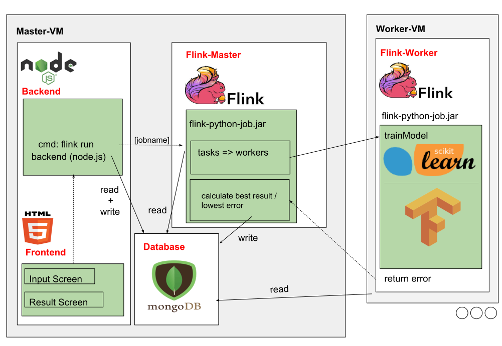
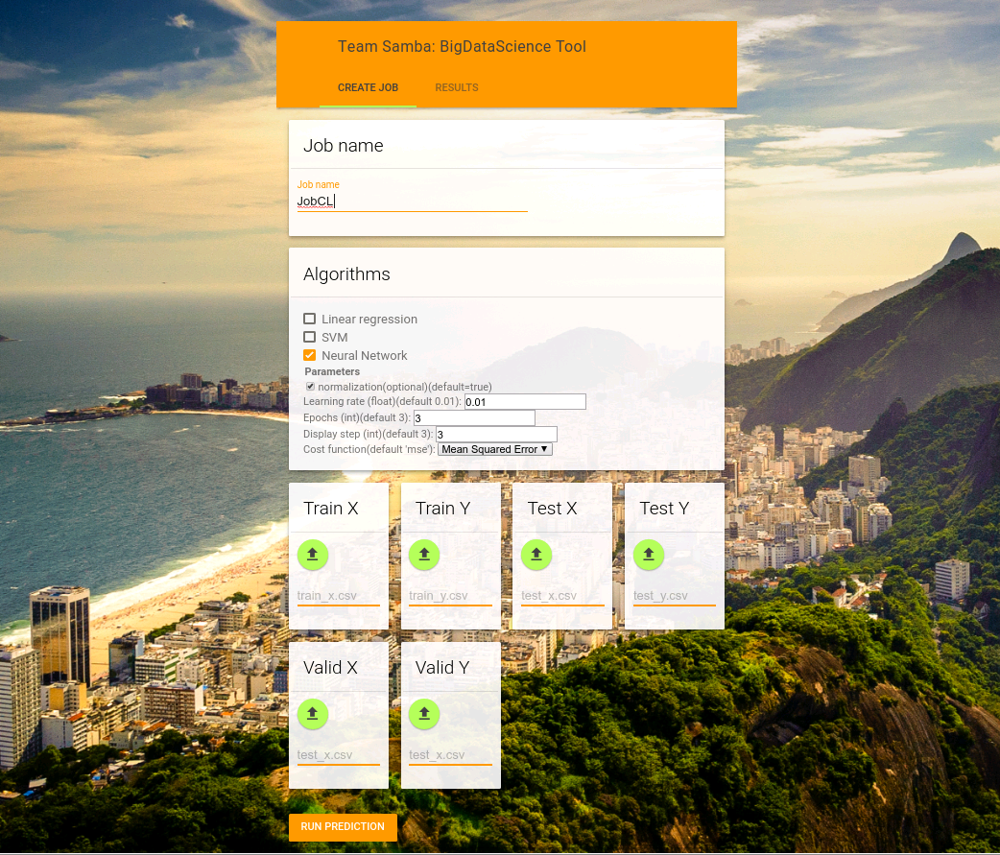
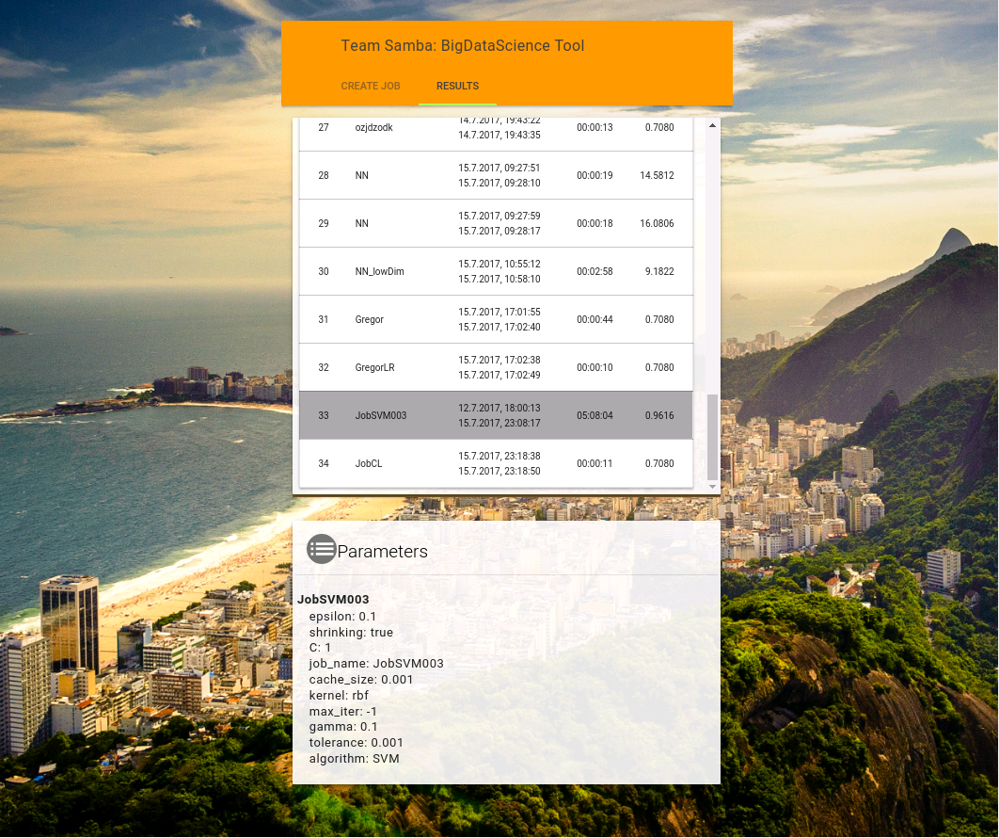

# SambaFlow
Distributed Hyper-Parameter-Optimization with Flink.
A Data Science Team-Project.

Data From KDD CUP 2017.
Prediction of traffic flow.
https://tianchi.aliyun.com/competition/information.htm?raceId=231597

Using NodeJS, mongoDB, Flink, python, TensorFlow, scikit-learn, ...

## Result

